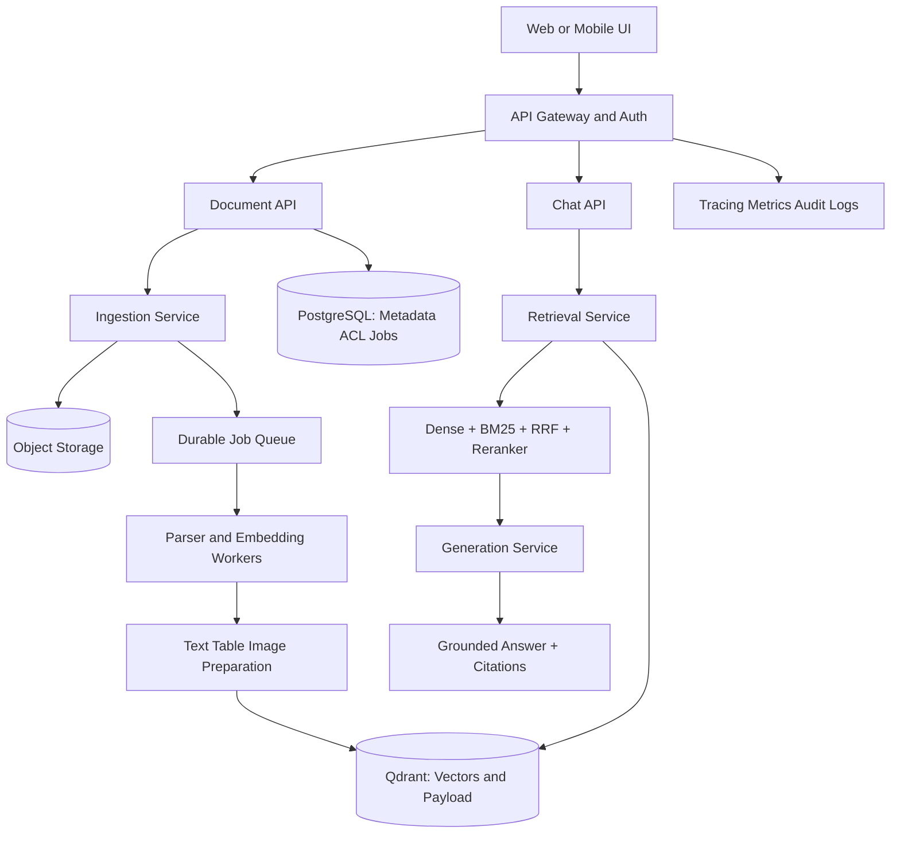

# Productionizing a Multimodal RAG Application

## Assignment 5 Submission

This folder contains the production-design solution for the Multimodal RAG Production Assignment.

- Assignment: `Multimodal_RAG_Production_Assignment.pdf`
- Main solution notebook: `Multimodal_RAG_Production_Solution.ipynb`
- Reference notebook: `RAG_Pipeline_sunny.ipynb`

The reference notebook demonstrates the V1 flow: PDF loading, chunking, embeddings, vector retrieval, and grounded generation. This submission redesigns that prototype as a secure, scalable, observable SaaS or enterprise architecture.

## Executive Summary

The production system separates presentation from backend responsibilities:

`Frontend -> API Layer -> Ingestion Service / Retrieval Service / Generation Service`

Large document processing is asynchronous. Original files and extracted artifacts are stored in object storage, transactional metadata and access control are stored in PostgreSQL, and Qdrant stores embeddings with filterable payload metadata. Retrieval combines dense search and sparse BM25 search, fuses candidates with Reciprocal Rank Fusion, reranks the candidates, applies authorization filters, and sends only the best evidence to the generation service.

The design supports multiple users, tenants, workspaces, documents, document versions, permissions, multimodal evidence, citations, evaluation, observability, future connectors, quotas, billing, and enterprise governance.

## 1. High-Level Production Architecture



### Architecture Explanation

- **Web or mobile UI:** Handles uploads, chat, processing status, source previews, page previews, sharing, and feedback. Streamlit may remain as an internal or demonstration interface.
- **API gateway and authentication:** Terminates TLS, validates OIDC or JWT tokens, applies rate limits, creates request IDs, and passes trusted identity claims to backend services.
- **Document API:** Validates uploads, performs malware checks, computes document hashes, creates document versions and ingestion jobs, and returns signed object-storage upload URLs.
- **Ingestion Service:** Coordinates object storage, queue messages, job state, retries, and version activation. It does not block the upload request while parsing occurs.
- **Durable job queue:** Buffers work, supports backpressure, and provides retry and dead-letter handling.
- **Parser and embedding workers:** Extract PDF text, OCR, tables, images, captions, chunks, and embeddings. CPU-heavy, memory-heavy, and GPU/provider-dependent workers scale independently.
- **Object storage:** Stores original PDFs, page images, extracted images, raw tables, normalized table data, and other binary artifacts.
- **PostgreSQL:** Stores users, tenants, workspaces, documents, versions, jobs, permissions, feedback, quotas, billing state, and audit events.
- **Qdrant:** Stores dense vectors and searchable payload metadata. Use payload partitioning or tenant/workspace filters instead of a collection for every user.
- **Retrieval Service:** Applies authorization filters, runs dense and sparse retrieval, fuses and reranks candidates, and constructs a bounded evidence set.
- **Generation Service:** Calls the multimodal LLM with only authorized evidence, produces grounded answers, cites source pages, and refuses unsupported claims.
- **Observability:** Collects traces, structured logs, metrics, quality signals, cost data, and audit events without exposing secrets or sensitive document content.

The API, ingestion, retrieval, generation, parser workers, embedding workers, storage, and observability components must be deployable and scalable independently.

## 2. Component Responsibility Table

| Component | Responsibility | Independent scaling or reliability concern |
|---|---|---|
| Frontend | Upload, chat, status display, source/page preview, sharing, feedback | CDN, browser sessions, responsive UI |
| API gateway | TLS, authentication, rate limits, request IDs, routing | Stateless horizontal replicas |
| Document API | File validation, hash calculation, version/job creation, signed upload URLs | Upload bursts and request latency |
| Chat API | Conversation management and generation requests | Concurrent chat traffic |
| Ingestion Service | Job orchestration, idempotency, state transitions, retry policy | Queue backpressure and worker capacity |
| Job queue | Durable commands, delayed retries, dead-letter messages | Delivery guarantees and queue depth |
| Parser workers | PDF parsing, OCR, section-aware chunking, table/image extraction | CPU, memory, and long-running workloads |
| Embedding workers | Text, image-caption, and table-summary embeddings | GPU capacity and provider quotas |
| Object storage | Original files and extracted binary artifacts | Capacity, lifecycle, retention, signed URLs |
| PostgreSQL | Metadata, users, tenants, workspaces, jobs, ACL, versions, feedback, audit | Transactions, indexes, backups |
| Qdrant | Dense vectors and filterable payloads | Shards, vector RAM, replication |
| Retrieval Service | ACL filtering, dense search, BM25, RRF, evidence selection | Low-latency replicas |
| Reranker | Cross-encoder or provider reranking of fused candidates | Model throughput and latency |
| Generation Service | Grounded multimodal prompt, answer, citations, refusal | Model concurrency, token usage, cost |
| Observability | Traces, logs, metrics, quality dashboards, audit records | Telemetry volume and cardinality control |

## 3. Multi-User and Multi-Tenant Data Model

### PostgreSQL Entities

- `users`: identity, OIDC subject, email, status, and tenant memberships.
- `tenants`: organization boundary, plan, quota, retention policy, and billing account.
- `workspaces`: tenant-owned collaboration boundary for teams and document collections.
- `documents`: tenant, workspace, owner, display name, status, and `active_version_id`.
- `document_versions`: document ID, SHA-256 hash, parser version, chunking version, embedding model, status, and timestamps.
- `jobs`: version ID, current state, attempt count, lease, checkpoint, error, and retry time.
- `permissions`: document or workspace ACL entries for users, groups, and roles such as owner, editor, viewer, legal, compliance, or operations.
- `conversations` and `messages`: user conversation history, feedback references, and generation metadata.
- `feedback`: thumbs up/down, optional comments, model version, and evidence IDs.
- `audit_events`: actor, tenant, action, resource, request ID, timestamp, and outcome.
- `usage_events`: token counts, provider, latency, estimated cost, and quota accounting.

### Qdrant Payload

Every vector point includes:

```json
{
  "tenant_id": "tenant-arka",
  "workspace_id": "workspace-legal",
  "document_id": "doc-001",
  "version_id": "version-003",
  "chunk_id": "chunk-0042",
  "owner_id": "user-001",
  "allowed_user_ids": ["user-001"],
  "allowed_roles": ["legal", "compliance"],
  "content_type": "text|image|table",
  "page_number": 4,
  "object_uri": "s3://bucket/doc-001/page-004/image-01.png",
  "acl_version": 7
}
```

Use one Qdrant collection per embedding model or compatible vector schema. Apply tenant, workspace, role, user, document, and version filters in the query itself. Do not create a separate collection for every user.

## 4. Asynchronous Ingestion Workflow

### Status Transitions

```text
uploaded -> queued -> parsing -> chunking -> enriching -> embedding -> indexing -> ready
```

A failed processing attempt moves to `retry_wait` conceptually and then returns to the relevant processing state. A terminal failure is recorded as `failed` and sent to a dead-letter queue.

### Workflow

1. The user uploads a file through the Document API.
2. The API validates file type and size, scans the file, computes SHA-256, and creates document/version metadata.
3. The binary is uploaded to object storage using a short-lived signed URL.
4. The API publishes an idempotent ingestion job and immediately returns `job_id`.
5. Parser workers claim the job with a lease and extract selectable text, OCR text, tables, images, and page metadata.
6. Chunking workers create section-aware text chunks and stable chunk IDs.
7. Enrichment workers create image captions, table summaries, normalized table records, and searchable metadata.
8. Embedding workers batch text, image-summary, and table-summary embeddings.
9. Indexing workers upsert vectors and payloads into Qdrant.
10. The service verifies the indexed version, atomically activates `active_version_id` in PostgreSQL, and marks the job `ready`.

### Failure, Retry, and Recovery

- Workers use leases and heartbeats so abandoned jobs can be reclaimed.
- Transient provider, network, and storage failures use exponential backoff with jitter.
- Each stage is checkpointed so a retry does not repeat completed work unnecessarily.
- Jobs carry an idempotency key based on document ID, version ID, parser version, and stage.
- Permanent failures record a safe error message, preserve the failed version for diagnosis, and move the job to a dead-letter queue.
- Operators can replay dead-letter jobs after correcting the cause.
- Queue depth, processing age, retry count, and dead-letter rate are monitored.
- The UI displays `uploaded`, `parsing`, `chunking`, `embedding`, `indexing`, `ready`, and `failed` states.

## 5. Retrieval Design

The retrieval path is:

```text
Authenticated query
    -> authorization and metadata filter
    -> dense search and sparse BM25 search in parallel
    -> candidate union
    -> Reciprocal Rank Fusion (RRF)
    -> cross-encoder or provider reranker
    -> metadata and diversity checks
    -> bounded Top-K evidence context
    -> grounded multimodal generation
```

### Dense Retrieval

Dense embeddings capture semantic similarity and paraphrases. Qdrant performs approximate nearest-neighbor search over authorized vector points. The initial candidate pool should be larger than the final generation context, for example 50 to 200 candidates depending on corpus size and latency budget.

### Sparse Retrieval with BM25

BM25 preserves exact terms that dense retrieval can miss, including clause numbers, asset IDs, dates, amounts, product names, and legal phrases. Run BM25 over an indexed text representation containing chunk text, headings, table summaries, OCR text, and image captions.

### Metadata Filtering

Build the authorization filter before searching. At minimum constrain:

- `tenant_id` from the authenticated token
- `workspace_id` selected by the user and verified against membership
- user, group, role, and document ACL conditions
- active document version
- optional collection, content type, page, date, or document filters

The same rule must be applied in PostgreSQL and Qdrant. UI hiding is not an authorization mechanism.

### RRF Fusion

RRF combines dense and sparse rankings without requiring their raw scores to be calibrated:

```text
RRF_SCORE(document) = sum(1 / (rrf_k + rank_i(document)))
```

A practical default is `rrf_k = 60`. The fused ranking benefits from semantic matches and exact lexical matches.

### Reranking and Top-K Context

A cross-encoder or managed reranker reads the query and candidate text together and improves ordering for the final evidence set. After reranking:

- keep only the best authorized candidates;
- apply a token and image budget;
- prefer evidence from complementary pages or content types;
- remove duplicate overlapping chunks;
- preserve document, page, table, and image citation metadata;
- pass Top-K evidence to generation, commonly 3 to 8 items depending on context limits.

The generation prompt must require evidence-only answers, citations such as `[source:page]`, explicit uncertainty, and refusal when evidence is insufficient.

## 6. Image and Table Retrieval Strategy

### Current V1 Limitation

The V1 approach is primarily dependent on OCR or extracted text. Images that contain meaning but little text are difficult to retrieve. Markdown-only tables can lose merged headers, column types, row relationships, dates, amounts, and exact values.

### Improved Image Path

```text
Image bytes
    -> object storage
    -> vision model caption and structured summary
    -> OCR plus detected entities and regions
    -> image summary embedding
    -> Qdrant point with page, bounding box, ACL, and object URI
```

Store the original image and a searchable record containing:

- caption and detailed vision summary;
- OCR text;
- detected entities, labels, and relationships;
- page number and bounding box;
- document/version/chunk IDs;
- object-storage URI;
- tenant and permission payload.

Retrieve image evidence through caption embeddings and lexical OCR search. The Generation Service may receive the original image when the model supports visual inputs.

### Future Advanced Image Path

Add native visual or multivector retrieval using late interaction, page-level image representations, or ColPali-style retrieval. This can preserve visual layout and chart relationships better than a single caption vector, but it has higher storage, compute, and serving complexity. Introduce it as an evaluated quality tier after the caption-based path is observable.

### Improved Table Path

Store all of the following rather than only Markdown:

- raw extracted table;
- table ID, document ID, version ID, and page number;
- headers and schema information;
- normalized typed rows and columns;
- searchable table summary;
- row-level and cell-level metadata where needed;
- source object URI and citation coordinates.

Use table-summary embeddings for semantic retrieval, BM25 over headers and values, and structured database-style lookup for exact questions involving rows, columns, dates, amounts, or entities. Send the normalized table and source citation to generation so the answer can be checked against exact values.

## 7. Security Model

### Authentication

Use OIDC or OAuth2 for user identity. Validate JWTs at the API gateway, check issuer/audience/signature/expiry, and derive the authenticated user and tenant membership on the server. Never accept tenant identity solely from a client-provided request field.

### Authorization

Use role-based access control plus document and workspace ACLs. Every Document API, Chat API, object-storage operation, PostgreSQL query, and vector search receives an authorization scope. Retrieval filters must be created from trusted claims and permission records before candidate search.

### Tenant Isolation

- Make `tenant_id` immutable after resource creation.
- Include tenant and workspace scope in every database row, object key, queue message, vector payload, and audit event.
- Verify tenant scope at service boundaries.
- Use PostgreSQL row-level security where appropriate.
- Use Qdrant payload filters and tenant/workspace partitioning.
- Add automated cross-tenant retrieval tests.
- Ensure cache keys include tenant, workspace, user, ACL version, and query scope.

### Secret Management

Use a managed secret store and short-lived credentials. Rotate provider keys, database credentials, signing keys, and encryption keys. Never store API keys in notebooks, source code, browser bundles, prompts, logs, or vector payloads.

### Data Protection and Auditability

Use TLS in transit and encryption at rest. Use signed, expiring object URLs. Apply malware scanning, retention and deletion policies, backup encryption, sensitive-data redaction, prompt-injection defenses, and least-privilege service accounts. Record append-only audit events for access, upload, share, export, deletion, permission changes, administration, and failed authorization attempts.

## 8. Document Versioning and Incremental Ingestion

1. Compute SHA-256 for every uploaded file.
2. Compare it with the active document version.
3. If the hash and processing configuration are unchanged, return `unchanged` and skip parsing and embedding.
4. If the content changes, create a new version linked to the same logical document.
5. Store parser, chunker, embedding, and enrichment versions with the new version.
6. Process the new version idempotently.
7. Upsert new Qdrant points using stable document/version/chunk identifiers.
8. Activate the new version only after indexing and validation succeed.
9. Tombstone or delete old Qdrant points by `document_id` and `version_id` according to retention policy.
10. Reprocess only changed documents, pages, or chunks when dependency hashes show that reuse is safe.

This prevents unchanged files from consuming unnecessary parsing, embedding, and model budget while preserving rollback and audit history.

## 9. Evaluation and Observability Plan

### Evaluation Dataset

Maintain a versioned golden set with:

| Field | Purpose |
|---|---|
| `question` | User query |
| `tenant_id` | Authorization scope |
| `workspace_id` | Retrieval scope |
| `expected_source` | Required document or source ID |
| `expected_answer` | Reference answer or answer facts |
| `expected_citations` | Required page or table citations |

Include text, OCR, image, table, exact-value, multi-document, unsupported-question, and cross-tenant negative cases.

### Quality Metrics

- Retrieval recall@K and precision@K
- Mean reciprocal rank and nDCG
- Groundedness or faithfulness score
- Answer correctness and expected-fact coverage
- Citation correctness and citation completeness
- Unsupported-answer refusal rate
- Cross-tenant leakage rate, with a target of zero
- User feedback rate and thumbs-up ratio

### Performance and Reliability Metrics

- API p50 and p95 latency
- Retrieval p50 and p95 latency
- Reranker latency
- Generation latency and time to first token
- Upload-to-ready time
- Queue depth and oldest job age
- Job success, retry, timeout, and dead-letter rates
- Provider error and rate-limit rates
- Availability and error budget consumption

### Cost Metrics

- Input and output tokens per answer
- Embedding tokens or provider calls per document
- Cost per document processed
- Cost per query and per tenant
- Cache hit rate
- Cost by model, workspace, and feature
- Storage and vector-index cost

### Tracing and Alerts

Trace each request across gateway, Document API or Chat API, retrieval, Qdrant, BM25, RRF, reranker, generation, and citations. Propagate `request_id`, `tenant_id`, `workspace_id`, `document_id`, `version_id`, and `job_id`. Redact document content, credentials, and sensitive values.

Alert on p95 latency regressions, queue growth, stale jobs, repeated worker failures, dead-letter growth, provider outages, cost spikes, groundedness regressions, citation failures, and any unauthorized retrieval result.

Every model, prompt, parser, chunking, embedding, retriever, reranker, and configuration change must be evaluated against the same golden set and compared with the previous release.

## 10. Product Capabilities to Plan For

The production design supports the following product capabilities:

- Workspaces and document collections
- Multiple PDFs and multi-document retrieval
- Conversation history
- Source preview and page preview
- Shareable chats
- User feedback with thumbs up/down and comments
- Admin analytics and quality dashboards
- Connectors for Google Drive, SharePoint, and S3
- Public and programmatic API access
- Audit logs
- Usage quotas
- Billing and subscription controls

These capabilities are enabled progressively after identity, authorization, durable ingestion, and observability are in place.

## 11. Recommended Implementation Roadmap

The implementation follows the assignment roadmap in its recommended order:

| Phase | Deliverable | Why it comes here |
|---|---|---|
| 1. Current V1 | Single-app parsing, dense retrieval, Qdrant, generation, and Streamlit | Establish the measurable baseline |
| 2. Multi-document and authentication | User identity, multiple documents, workspaces, ownership, authenticated access | Identity and scope must exist before sharing or multi-tenant retrieval |
| 3. Async ingestion and storage | Object storage, PostgreSQL, queue, parser workers, retries, and versioning | Move long-running work out of user requests and persist state reliably |
| 4. Tenant and RBAC filtering | Tenant, workspace, role, permission, and audit enforcement in retrieval | Prevent data leakage before increasing retrieval scale |
| 5. Hybrid retrieval and reranking | Dense plus BM25, RRF, reranker, evidence budget, regression tests | Improve evidence quality after authorization is trustworthy |
| 6. Better multimodal retrieval | Vision summaries, image embeddings, structured tables, future visual/multivector path | Improve image and table quality with measurable trade-offs |
| 7. Evaluation and observability | Offline evaluation, tracing, latency, cost, reliability, feedback loops, dashboards | Make quality and operations measurable before broad rollout |
| 8. Production API and frontend | Clean public APIs, dedicated frontend, previews, shareable chats, feedback | Turn the internal pipeline into a usable product |
| Phase 9. Enterprise integrations and billing | Drive/SharePoint/S3 connectors, quotas, auditability, billing, retention, governance | Add enterprise controls after the core platform is reliable |

The sequence prioritizes isolation and identity first, durable processing before scale, retrieval quality before model tuning, and measurement before product expansion.

## 12. Expected Submission and Rubric Coverage

| Required submission item | Covered in this README and notebook |
|---|---|
| High-level architecture diagram and explanation | Section 1 |
| Component responsibility table | Section 2 |
| Multi-user and multi-tenant data model | Section 3 |
| Asynchronous ingestion, status transitions, failure and retry handling | Section 4 |
| Dense, sparse/BM25, RRF, reranking, metadata filtering, and Top-K context | Section 5 |
| Image and table strategy, including V1 limitation and improved approach | Section 6 |
| Authentication, authorization, tenant isolation, secrets, and auditability | Section 7 |
| Document versioning and incremental ingestion | Section 8 |
| Evaluation and observability with measurable metrics | Section 9 |
| Product capabilities | Section 10 |
| Phased roadmap and sequencing rationale | Section 11 |

The design addresses every rubric area:

- **Architecture and service separation, 20 marks:** Clear boundaries, target flow, responsibilities, data flow, and independent scaling.
- **Ingestion and storage design, 15 marks:** Async queue and workers, object storage, PostgreSQL, retries, dead-letter handling, hashing, and version activation.
- **Security and multi-tenancy, 15 marks:** Authentication, RBAC/ACL, tenant isolation, payload filters, secret management, encryption, and auditability.
- **Retrieval quality, 15 marks:** Dense retrieval, BM25, RRF, reranking, metadata filtering, evidence budgets, and Top-K generation context.
- **Multimodal design, 10 marks:** Vision captions and embeddings, original image access, structured table representations, exact lookup, and future visual retrieval.
- **Evaluation and observability, 15 marks:** Golden dataset, retrieval and answer quality, citations, groundedness, latency, reliability, cost, tracing, and alerts.
- **Roadmap and product thinking, 10 marks:** Practical nine-phase sequencing plus workspaces, connectors, APIs, feedback, quotas, billing, retention, and governance.

## Running the Notebook

The notebook contains short Markdown sections and small credential-free Python examples for job states, content hashing, multimodal records, authorization-aware hybrid retrieval, RRF, and evaluation metrics. The examples do not require API keys or cloud services.

For a full implementation, configure the required providers and services outside the notebook:

- PostgreSQL for metadata and ACL records
- S3-compatible object storage for binaries and extracted artifacts
- Qdrant for vector search and payload filtering
- A BM25 or sparse-search index
- A cross-encoder or managed reranker
- OCR, vision, embedding, and multimodal LLM providers
- A durable queue and worker runtime
- OpenTelemetry-compatible tracing and metrics

The notebook is a production architecture submission and reference design. It intentionally separates the interfaces and operating decisions from provider-specific deployment code.
